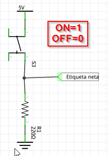
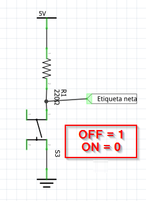
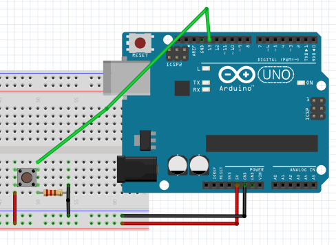
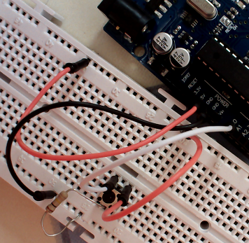

# Esto esta bien

Lo correcto es hacerlo a través de resistencias, hay dos configuraciones, pull down o pull up según si la resistencia está abajo o arriba 

la más utilizada y lógica es la primera pull down, pues lo lógico es que cuando se cierra el pulsador, queremos transmitir un 1 lógico

El valor de la resistencia puede ser de valores de algunos k

Visto en la placa el formato pull down:

Es decir (en la foto el cable verde del anterior dibujo es el blanco en la foto):

